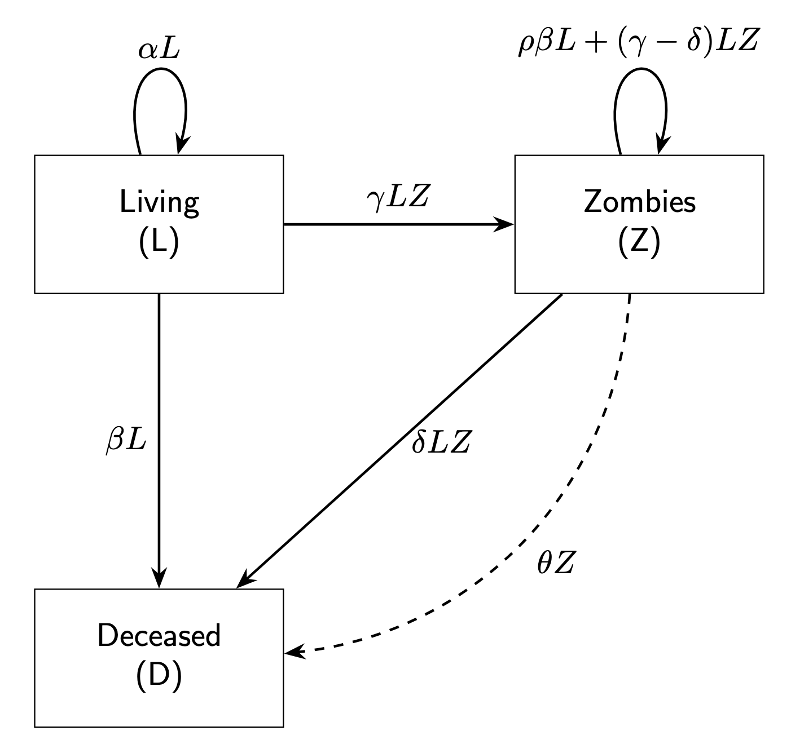

# 🧟 Zombies Apocalypse Simulation

This project simulates population dynamics between humans (`L`) and zombies (`Z`) using discrete-time and continuous time Lotka-Volterra model type with periodic zombie removal events based on [this paper](https://www.scielo.br/j/rbef/a/YSy6tP3JBSZ3CVgVYTtp5VG/?lang=en&format=html). We modify the based model idea for receiving Dirac delta-like interventions (in parameters or directly on populations). The tests were applied computationally. The analysis was made just for reviewing the paper model. These interventions (called vaccines in this experiments) are modeled as **Dirac delta-like pulses** that reduce the zombie population at fixed intervals, simulating vaccines or external control mechanisms.

## 🧪 How to Run the Simulation

### 1. 🐍 Create environment and install dependencies

If you don't have Poetry installed yet:

```bash
    pip install poetry
``` 
Then install dependencies defined in pyproject.toml:
```
    poetry install
``` 
2. ▶️ Run the simulation
Use the following command to run the main script (from the project root):

```
    poetry run python zombies_apocalypse_vaccine_normal.py
``` 

After the simulation, a plot will be saved automatically under ./results/ with the same name as the script:

```
    results/zombies_apocalypse_vaccine_normal.png
````

📈 What is being simulated?
L (humans): susceptible population.
Z (zombies): infected/hostile population.

Two different possibilities for exogenous intervetions: 

1 - (Normal)Vaccine/Intervention: every vaccine_period time steps, 10% of the zombie population is removed instantly, like a Dirac delta impulse.



Results: 


2 - (New or different) Vaccine/Intervention: every vaccine_period time steps, to modify the effectivenss or ratio of L,Z interaction converting humans into zombies. --> this version seems to be more realistic in terms of interaction.


Results: 


Comparisons: plots show both the model with and without interventions.

🔧 Modify parameters
To customize simulation parameters, edit the values in:

# In zombies_apocalypse_vaccine_normal.py
```
vaccine_period = 20         # how often the intervention is applied
zombie_removal_ratio = 0.1  # how much of Z is removed
time_steps = 1000           # total simulation steps
```
📤 Output
The script saves a .png plot showing:

Human and zombie populations over time with intervention.
Comparison against a baseline without intervention.
Vertical impulses representing intervention events (Dirac delta-like).

📚 Requirements
All dependencies are managed via Poetry:
```
    Python 3.11+

    NumPy

    SciPy

    Matplotlib
```
You can find and modify them in the [tool.poetry.dependencies] section of pyproject.toml.


# Sistema Final 23/06/2025

La simulación está en zombies sistema final. Asumimos eventos de interacción mutuamente excluyentes y provenientes de distribuciones aleatorias. Zombies (Z) pueden infectar Civiles (C) con probabilidad $\beta_{CZ}$ y Militares (M) con probabilidad $\beta_{MZ}$. Los civiles pueden convertirse en militares con una tasa $E$ de entrenamiento. La población civil nace a una tasa $\alpha$ y muere naturalmente a una tasa $\beta$. La población civil puede asesinar zombies a una tasa $\epsilon_{CZ}$ y una parte de los muertos naturales tanto Civiles como Militares pueden convertirse en Zombie en una proporción $\rho$. Los Militares pueden asesinar Zombies con una probabilidad $\gamma_{MZ}$. Los Militares también pueden morir naturalmente a la misma tasa que los Civiles. El sistema es dado por: 

```math
\begin{aligned}
\frac{dC}{dt} &= (\alpha - \beta - E) \cdot C - \beta_{CZ} \cdot C \cdot Z \\
\frac{dZ}{dt} &= (\beta_{CZ} - \epsilon_{CZ}) \cdot C \cdot Z + \rho \cdot \beta \cdot (C + M) + (\beta_{MZ} - \gamma_{MZ}) \cdot Z \cdot M \\
\frac{dM}{dt} &= E \cdot C - \beta \cdot M - \beta_{MZ} \cdot Z \cdot M \\
\frac{dD}{dt} &= (1 - \rho) \cdot \beta \cdot (C + M) + \epsilon_{CZ} \cdot C \cdot Z + \gamma_{MZ} \cdot Z \cdot M
\end{aligned}
```

Del análisis $\frac{dC}{dt} = 0$, $\frac{dZ}{dt}=0$, $\frac{dM}{dt} =0$ es posible obtener los siguientes escenarios de puntos críticos: 

1 - $\hat{Z}=\dfrac{\alpha-\beta-E}{\beta_{CZ}}$

2 - $\hat{M}=\dfrac{E\beta_{CZ}}{\beta \beta_{CZ}+\beta_{MZ}(\alpha-\beta-E))}$

3 - Si $\rho \beta \beta_{CZ}\rightarrow 0$ entonces: 

$
\hat{C}=\dfrac{\gamma_{MZ}-\beta_{MZ}}{\beta_{CZ}-\epsilon_{CZ}}
$

Tocaria analizar los casos $(\hat{Z},\hat{M},\hat{C})$ coexistencia; $(0,\hat{M},\hat{C})$ supremacia; $(\hat{Z},0,0)$ exitinción. Estos casos solo tienen sentido si las poblaciones toman valores positivos. Los casos son: 

1 - Para $\hat{Z}=\dfrac{\alpha-\beta-E}{\beta_{CZ}}$ se requiere $\alpha \geq \beta + E$

2 - Para $\hat{M}=\dfrac{E\beta_{CZ}}{\beta \beta_{CZ}+\beta_{MZ}(\alpha-\beta-E))}$ consideramos que $\alpha \geq \beta + E$ se mantiene asi no lidiamos con valores negativos.

3 - Para $
\hat{C}=\dfrac{\gamma_{MZ}-\beta_{MZ}}{\beta_{CZ}-\epsilon_{CZ}}
$ es el caso delicado, aqui $\gamma_{MZ}\geq \beta_{MZ}$ y $\beta_{CZ}>\epsilon_{CZ}$ para tener sentido biológico.

# Jacobiano

```math
J =
\begin{bmatrix}
\frac{\partial f_1}{\partial C} & \frac{\partial f_1}{\partial Z} & \frac{\partial f_1}{\partial M} \\
\frac{\partial f_2}{\partial C} & \frac{\partial f_2}{\partial Z} & \frac{\partial f_2}{\partial M} \\
\frac{\partial f_3}{\partial C} & \frac{\partial f_3}{\partial Z} & \frac{\partial f_3}{\partial M}
\end{bmatrix}
=
\begin{bmatrix}
(\alpha - \beta - E) - \beta_{CZ} Z & -\beta_{CZ} C & 0 \\
(\beta_{CZ} - \epsilon_{CZ}) Z + \rho \beta & (\beta_{CZ} - \epsilon_{CZ}) C + (\beta_{MZ} - \gamma_{MZ}) M & \rho \beta + (\beta_{MZ} - \gamma_{MZ}) Z \\
E & -\beta_{MZ} M & -\beta - \beta_{MZ} Z
\end{bmatrix}
```


👨‍🔬 Author
Rodolfo Lobo
University of Chile
📧 rodolfolobo@ug.uchile.cl